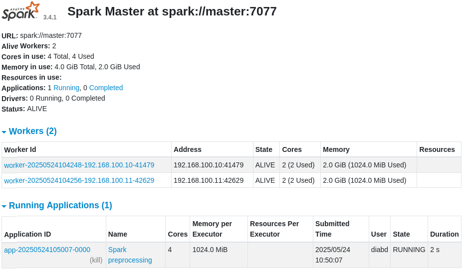
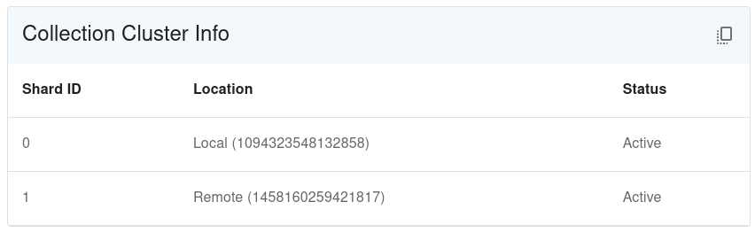
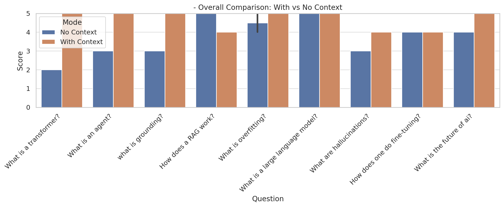

# ProgettoBigData
# Sistema Distribuito di Retrieval-Augmented Generation (RAG) per Documenti Scientifici

## Introduzione

Questo progetto ha l’obiettivo di costruire un sistema distribuito in grado di effettuare **Retrieval-Augmented Generation (RAG)** su un ampio insieme di documenti scientifici apparteneneti alla categoria di Artificial Intelligence. L’intero sistema è stato implementato e testato in un cluster composto da due macchine virtuali (una master e una worker), configurate per lavorare in modo cooperativo tramite strumenti di elaborazione e memorizzazione distribuita.

Il progetto si articola in più fasi, a partire dalla distribuzione, gestione e preprocessamento di un dataset scientifico di grandi dimensioni, fino all’indicizzazione semantica dei documenti tramite embeddings, al caricamento e indicizzazione in un database vettoriale e alla generazione contestualizzata delle risposte tramite modello linguistico. In fase finale, il sistema è anche in grado di valutare automaticamente la qualità delle risposte generate attraverso l'uso di un 'LLM as a Judge'.

## Dataset

Il dataset utilizzato è stato scaricato da Kaggle al seguente link:  
[https://www.kaggle.com/datasets/Cornell-University/arxiv](https://www.kaggle.com/datasets/Cornell-University/arxiv)

Si tratta del dump completo del database arXiv, fornito dalla Cornell University (versione 234), in formato JSON e con una dimensione di circa **4,7 GB**. Ogni elemento del dataset rappresenta un articolo scientifico pubblicato su arXiv.org e contiene diversi metadati:
- `id`: identificativo dell'articolo su arXiv;
- `title`: titolo;
- `abstract`: riassunto;
- `authors`: lista degli autori;
- `categories`: insieme delle categorie arXiv associate;
- `update_date`: ultima data di aggiornamento.

Il dataset è stato inizialmente **caricato all'interno di HDFS**, per poter essere gestito tramite strumenti di elaborazione distribuita. 

## Preprocessing tramite Apache Spark su HDFS (Hadoop Distribuited File System)
Inizialmente, il dataset originale  distribuito in HDFS è stato prima **filtrato** per selezionare solamente gli articoli appartenenti alla categoria `cs.AI` (Artificial Intelligence).
Il dataset filtrato è stato poi preprocessato con l'obiettivo di:
- ripulire i testi rimuovendo caratteri indesiderati e formattazioni non necessarie;
- normalizzare il contenuto degli abstract;
- suddividere ciascun abstract in uno o più **chunk** testuali coerenti, pronti per la successiva elaborazione semantica;
- estrazione dei metadati (come ID dell’articolo, titolo, e categoria) che saranno utilizzati in fase di risposta per arricchire il contesto.
Queste operazioni sono state effettuate tramite **Apache Spark** nella modalità standalone.

Il risultato è un file JSON contenente i chunk di testo associati agli articoli `cs.AI` e con i relativi metadati, già pronti per la fase di embedding.

## Calcolo Distribuito degli Embedding con Ray tramite modello SentenceTransformers

Una volta ottenuti i chunk, è stata avviata la fase di calcolo degli **embedding vettoriali** mediante l’uso del framework **Ray**, che consente l’elaborazione distribuita e parallela su più nodi del cluster. Per la generazione degli embedding è stato utilizzato il modello `all-MiniLM-L6-v2` fornito dalla libreria **SentenceTransformers**, in grado di produrre rappresentazioni numeriche semanticamente significative dei testi.

## Indicizzazione embeddings in Qdrant (Vector Database)

Il file risultante contenente tutti gli embedding e i relativi metadati è stato caricato all’interno di **Qdrant**, un **vector database** ottimizzato per il retrieval semantico. Qdrant è stato configurato in modalità distribuita e utilizza l’algoritmo **HNSW (Hierarchical Navigable Small World)** per indicizzare i vettori e permettere il recupero efficiente dei documenti semanticamente più rilevanti rispetto a una query.

## Generazione delle Risposte con LLM puro e LLM + RAG

Una volta indicizzati i documenti, è stato realizzato uno script che implementa il comportamento completo del sistema RAG: a partire da una **query in linguaggio naturale** inserita dall’utente, il sistema effettua il retrieval dei documenti più rilevanti tramite Qdrant, ed elabora una risposta **contestualizzata** utilizzando il modello linguistico **phi-4**, chiamato ed eseguito tramite API gratuite fornite da https://openrouter.ai/ oppure scaricato ed eseguito localmente.

Viene inoltre generata una seconda risposta senza contesto, ottenuta direttamente dall' LLM  **senza l’uso di documenti di contesto**, al fine di permettere un confronto tra i due approcci e verificarne la qualità in base ad alcuni criteri..

## Valutazione Automatica delle Risposte (LLM as a Judge)

Come fase finale, il sistema integra un modulo di **valutazione automatica** delle risposte, basato sul paradigma *LLM-as-a-Judge*. Viene utilizzato il modello linguistico **LLaMA 3**, accessibile tramite le **API gratuite di OpenRouter**, per confrontare le due risposte (quella "pura" e quella RAG) secondo criteri quali:
- completezza,
- accuratezza,
- coerenza,
- aderenza al contesto.

L'obiettivo di questa parte finale è fornire un sistema oggettivo di **valutazione della qualità** delle risposte generate, simulando il comportamento di un giudice umano.

---

## FASE 1 – Configurazione di rete e delle VM

Sono state configurate due macchine virtuali Ubuntu 22.04.5 LTS, denominate `master` e `worker`, collegate tramite una "Rete con NAT" personalizzata con subnet `192.168.100.0/24`. In questa fase si è proceduto all’assegnazione di indirizzi IP statici, all’impostazione degli hostname e alla definizione delle regole di risoluzione dei nomi.

Per impostare l’hostname su ciascuna macchina:

Sulla VM master:
sudo hostnamectl set-hostname master

Sulla VM worker:
sudo hostnamectl set-hostname worker

Dopo la modifica, entrambe le VM sono state riavviate e per assegnare un IP statico alla VM master, è stato modificato il file di configurazione di Netplan /etc/netplan/01-netcfg.yaml:

```
network:
  version: 2
  ethernets:
    enp0s8:
      dhcp4: no
      addresses: [192.168.100.10/24]
```

Sulla VM worker, è stato configurato lo stesso file con il contenuto seguente:

```
network:
  version: 2
  ethernets:
    enp0s8:
      dhcp4: no
      addresses: [192.168.100.11/24]
```

E' importante attuare l' applicazione delle modifiche in tutti e due i nodi tramite il comando:
sudo netplan apply

Successivamente è stato aggiornato il file /etc/hosts su entrambe le VM nel file /etc/hosts per avere una mappatura indirizzoIP-nome:

Sono state aggiunte in fondo le seguenti righe:
```
192.168.100.10    master
192.168.100.11    worker
```

Infine, è stata verificata la connettività tra le due macchine virtuali tramite i seguenti comandi:

Dalla VM master:
ping worker

Dalla VM worker:
ping master

Le risposte positive ai comandi di ping hanno confermato il corretto funzionamento della rete e della risoluzione dei nomi host all’interno del cluster.

Per consentire la comunicazione via SSH tra le due macchine virtuali `master` e `worker` senza dover inserire la password ogni volta, è stata configurata un’autenticazione basata su chiavi. Di seguito sono riportati i passaggi effettuati.

### Installazione dei componenti SSH

Sulla macchina master è stato installato il client SSH (se non già presente):

sudo apt update  
sudo apt install openssh-client -y

Sulla macchina worker è stato installato e avviato il server SSH:

sudo apt update  
sudo apt install openssh-server -y  
sudo systemctl enable ssh  
sudo systemctl start ssh

Per verificare che il servizio sia attivo:

systemctl status ssh

Il servizio risulta correttamente attivo se lo stato visualizzato è `active (running)`.

### Generazione della chiave SSH sulla macchina master

Sul nodo master è stata generata una nuova coppia di chiavi RSA:

ssh-keygen -t rsa

Durante la generazione della chiave, è stato premuto INVIO per tre volte, accettando tutti i valori di default e lasciando la passphrase vuota.

### Copia della chiave pubblica sul nodo worker

Dalla macchina master è stata copiata la chiave pubblica sul nodo worker:

ssh-copy-id diabd@worker

Alla prima connessione, è stato necessario confermare con `yes` e inserire la password dell’utente `diabd` sul nodo worker. Dopo questa operazione, la chiave pubblica è stata correttamente installata.

### Verifica dell’accesso senza password

È stato verificato l’accesso al nodo worker dal nodo master:

ssh diabd@worker


## FASE 2 – Installazione e configurazione di HDFS (Hadoop Distributed File System)

Questa fase include l’installazione di Java e Hadoop su entrambe le VM, la configurazione dei file principali su master, la copia della configurazione sul nodo worker, l’inizializzazione del filesystem distribuito HDFS e il caricamento del dataset su HDFS per l’elaborazione successiva.

### Installazione di Java (su entrambe le VM)

sudo apt update  
sudo apt install openjdk-8-jdk -y

La versione 8 di Java è stata scelta per garantire compatibilità e stabilità con le tecnologie utilizzate nel progetto.

### Download e installazione di Hadoop (su entrambe le VM)

cd ~  
wget https://downloads.apache.org/hadoop/common/hadoop-3.3.6/hadoop-3.3.6.tar.gz  
tar -xvzf hadoop-3.3.6.tar.gz  
mv hadoop-3.3.6 hadoop

### Configurazione delle variabili d'ambiente (su entrambe le VM)

nano ~/.bashrc

Aggiungere in fondo al file:

```
export HADOOP_HOME=/home/diabd/hadoop  
export PATH=$PATH:$HADOOP_HOME/bin:$HADOOP_HOME/sbin  
export JAVA_HOME=/usr/lib/jvm/java-8-openjdk-amd64
```

Applicare le modifiche:

source ~/.bashrc

### Configurazione Hadoop sul nodo master

Modifica dei file di configurazione nella directory `~/hadoop/etc/hadoop`.

#### core-site.xml

nano ~/hadoop/etc/hadoop/core-site.xml

Contenuto:

```
<configuration>
  <property>
    <name>fs.defaultFS</name>
    <value>hdfs://master:9000</value>
  </property>
</configuration>
```

#### hdfs-site.xml

nano ~/hadoop/etc/hadoop/hdfs-site.xml

Contenuto:

```
<configuration>
  <property>
    <name>dfs.replication</name>
    <value>2</value>
  </property>
  <property>
    <name>dfs.namenode.name.dir</name>
    <value>file:///home/diabd/hadoopdata/dfs/name</value>
  </property>
  <property>
    <name>dfs.datanode.data.dir</name>
    <value>file:///home/diabd/hadoopdata/dfs/data</value>
  </property>
</configuration>
```

#### workers

nano ~/hadoop/etc/hadoop/workers

Contenuto:

```
master  
worker
```

#### masters

nano ~/hadoop/etc/hadoop/masters

Contenuto:

```
master
```

### Copia della configurazione Hadoop al nodo worker

Dalla macchina master:

'scp -r ~/hadoop diabd@worker:~'

### Formattazione del Namenode e avvio HDFS

Sul nodo master:

hdfs namenode -format

Su entrambe le macchine (master e worker), aprire il file:

nano ~/hadoop/etc/hadoop/hadoop-env.sh

Trovare la riga commentata " # export JAVA_HOME= ... "

e modificarla in "

export JAVA_HOME=/usr/lib/jvm/java-8-openjdk-amd64


Sul nodo master, riavviare HDFS:

stop-dfs.sh  
start-dfs.sh


Successivamente, verificare i processi attivi con il comando jps:

Sul master devono essere visibili: NameNode, DataNode, SecondaryNameNode  
Sul worker deve essere visibile: DataNode

### Caricamento del dataset su HDFS

Il file `arxiv-metadata-oai-snapshot.json` è stato scaricato direttamente da:  
https://www.kaggle.com/datasets/Cornell-University/arxiv  
e salvato nella directory `/home/diabd/` del nodo master.

Creazione della directory in HDFS:

hdfs dfs -mkdir /dataset

Caricamento del dataset:

hdfs dfs -put arxiv-metadata-oai-snapshot.json /dataset/

Verifica della presenza del file:

hdfs dfs -ls /dataset

L’output atteso conferma che il file è stato caricato correttamente:

-rw-r--r--   1 diabd supergroup 4.5G  /dataset/arxiv-metadata-oai-snapshot.json

Verifica della distribuzione dei blocchi su HDFS:

hdfs fsck /dataset/arxiv-metadata-oai-snapshot.json -files -blocks -locations

L’output di questo comando consente di controllare che i blocchi del file siano effettivamente replicati e distribuiti tra i nodi master e worker, come previsto dalla configurazione.  
Nel nostro caso sono presenti 35 blocchi distribuiti, valore coerente considerando che la dimensione predefinita dei blocchi in HDFS è di 128 MB.


## FASE 3 – Preprocessing distribuito con Apache Spark nel cluster

In questa fase è stato utilizzato Apache Spark in modalità Standalone distribuita per eseguire il preprocessing del dataset arXiv in parallelo sul cluster (master e worker). L’obiettivo era filtrare gli articoli appartenenti alla categoria `cs.AI` e generare chunk testuali a partire dagli abstract, in modo da preparare i dati per la fase successiva di embedding.

### Installazione di Apache Spark (su entrambe le VM)

cd ~  
wget https://archive.apache.org/dist/spark/spark-3.4.1/spark-3.4.1-bin-hadoop3.tgz  
tar -xvzf spark-3.4.1-bin-hadoop3.tgz  
mv spark-3.4.1-bin-hadoop3 spark

Configurazione delle variabili d’ambiente:

nano ~/.bashrc

Aggiungere in fondo:

export SPARK_HOME=/home/diabd/spark  
export PATH=$PATH:$SPARK_HOME/bin:$SPARK_HOME/sbin  
export JAVA_HOME=/usr/lib/jvm/java-8-openjdk-amd64

Applicare:

source ~/.bashrc

Verifica dell’installazione:

spark-shell --version

### Configurazione del cluster Spark distribuito

Abilitazione e modifica del file `spark-env.sh`:

cp $SPARK_HOME/conf/spark-env.sh.template $SPARK_HOME/conf/spark-env.sh  
nano $SPARK_HOME/conf/spark-env.sh

Configurazione su master:

export SPARK_MASTER_HOST=master  
export JAVA_HOME=/usr/lib/jvm/java-8-openjdk-amd64  
export SPARK_WORKER_CORES=2  
export SPARK_WORKER_MEMORY=2g

Configurazione su worker:

export JAVA_HOME=/usr/lib/jvm/java-8-openjdk-amd64  
export SPARK_WORKER_CORES=2  
export SPARK_WORKER_MEMORY=2g

Avvio del cluster Spark:

Sul master:  
$SPARK_HOME/sbin/start-master.sh  
$SPARK_HOME/sbin/start-worker.sh spark://master:7077

Sul worker:  
$SPARK_HOME/sbin/start-worker.sh spark://master:7077

Controllo del cluster dal browser:  
http://192.168.100.10:8080  
Devono risultare visibili entrambi i nodi (1 master + 1 worker).

### Installazione di PySpark e NLTK (su entrambe le VM)

pip3 install pyspark nltk

Configurazione dei dati NLTK (Natural Language Toolkit) :

python3  
>>> import nltk  
>>> nltk.download('punkt')  
>>> exit()

Definizione del path locale per i dati NLTK:

nano ~/.bashrc

Aggiungere:

export NLTK_DATA=/home/diabd/nltk_data

Applicare:

mkdir -p /home/diabd/nltk_data  
python3 -m nltk.downloader -d /home/diabd/nltk_data punkt  
source ~/.bashrc

### Esecuzione degli script Spark

Sono stati creati ed eseguiti due script PySpark per l’elaborazione distribuita del dataset:

- `spark_filter_ai.py`: effettua il filtraggio degli articoli scientifici appartenenti alla categoria `cs.AI`, producendo in output il file `arxiv_ai_filtered.json` salvato su HDFS.
  
- `spark_preprocess.py`: esegue il preprocessing degli abstract e la creazione dei chunk testuali (2 frasi per chunk), producendo il file `processed_dataset.json` salvato su HDFS.

Gli script sono stati eseguiti dal nodo master utilizzando:

$SPARK_HOME/bin/spark-submit --master spark://master:7077 nome_script.py

<p align="center">
  
</p>

### Verifica dell’output

Verifica del contenuto della directory HDFS risultante:

hdfs dfs -ls /dataset/processed_dataset.json

Dato che l’output è distribuito in più partizioni, è stato unificato in un singolo file locale:

hdfs dfs -getmerge /dataset/processed_dataset.json processed_dataset.json

Controllo del contenuto unificato:

head -n 3 processed_dataset.json | jq .

Il file risultante contiene i chunk già normalizzati e arricchiti con metadati (id, titolo, autori, anno), ed è pronto per la fase successiva di generazione degli embedding.


## FASE 4 – Calcolo distribuito degli embedding con Ray

In questa fase è stato utilizzato Ray, un framework open-source progettato per scalare applicazioni Python in modo efficiente su più nodi. Ray è stato impiegato per generare gli embedding a partire dai chunk testuali ottenuti nella fase precedente, consentendo l'esecuzione parallela dei task tra i nodi del cluster e riducendo significativamente i tempi di elaborazione rispetto a un approccio sequenziale.

### Installazione di Ray e preparazione del cluster (su entrambe le VM)

Installazione di `pip` per Python 3:

sudo apt update  
sudo apt install python3-pip -y

e verifica installazione con pip3 --version .

Installazione di Ray:

pip install ray

Aggiunta di `~/.local/bin` al `PATH` per rendere eseguibili i binari locali:

echo 'export PATH=$PATH:$HOME/.local/bin' >> ~/.bashrc  
source ~/.bashrc

### Avvio del cluster Ray

Sul nodo master:

ray start --head --node-ip-address=192.168.100.10 --port=6379

Sul nodo worker:

ray start --address='192.168.100.10:6379' --node-ip-address=192.168.100.11

Verifica dello stato del cluster:

ray status

Se correttamente configurato, si può visualizzare che entrambi i nodi risultano attivi nel cluster Ray ed è pronto per eseguire job distribuiti in parallelo.

---

### Funzionamento di Ray nel progetto

Ray consente l’esecuzione parallela di **funzioni remote** definite come task (`@ray.remote`) su più nodi. In questo progetto, ogni batch di chunk testuali viene processato in parallelo da più worker, che calcolano gli embedding utilizzando il modello `all-MiniLM-L6-v2` della libreria `sentence-transformers`.

Il modello viene caricato una sola volta e condiviso tra i nodi tramite il **Ray object store** (`ray.put()`), evitando di duplicarne il caricamento su ogni processo. I dati in input vengono divisi in batch (es. da 64 elementi) e ogni batch viene inviato a un worker del cluster.

Questo approccio consente di:
- sfruttare appieno le risorse CPU disponibili su entrambe le VM;
- scalare il calcolo man mano che aumentano i dati o i nodi;
- ridurre i tempi di attesa grazie all’esecuzione concorrente delle operazioni.

---

### Calcolo degli embedding

Assicurarsi che il file `processed_dataset.json` sia disponibile localmente sul nodo master.

Installare la libreria `sentence-transformers` per il calcolo degli embedding (su entrambe le VM):

pip3 install sentence-transformers

Creazione dello script `ray_embeddings.py`, che:
- carica il modello `all-MiniLM-L6-v2`;
- divide i chunk in batch;
- distribuisce ogni batch come task remoto su Ray;
- raccoglie gli embedding calcolati e li salva in un file JSON.

Esecuzione dello script dal nodo master:

python3 ray_embeddings.py

Al termine dell’esecuzione viene generato il file `embedded_chunks.json`, contenente tutti i chunk con i rispettivi embedding e metadati.

Questo file è l’output finale della fase di rappresentazione semantica dei dati ed è pronto per essere caricato in un vector database per il retrieval.


## FASE 5 – Caricamento degli embedding su Qdrant (vector database distribuito)

In questa fase è stato utilizzato **Qdrant**, un motore di ricerca vettoriale open-source, per l’indicizzazione semantica degli embedding generati nella fase precedente. La configurazione è avvenuta in modalità distribuita su due nodi, utilizzando container Docker su entrambe le VM (`master` e `worker`).

Qdrant è stato configurato come cluster, dove il nodo `master` agisce da leader e il nodo `worker` da follower. Gli embedding vengono caricati dal nodo master tramite uno script Python, e indicizzati per abilitare il successivo retrieval semantico basato su similarità.

### Configurazione del cluster Qdrant

Sul nodo `master` e sul nodo `worker` è stata creata la seguente struttura:

mkdir -p ~/qdrant_cluster/data  
cd ~/qdrant_cluster

All’interno della directory sono stati posizionati:
- un file `docker-compose.yml` personalizzato,
- la cartella `data/` utilizzata come volume per la persistenza dei dati.

#### File `docker-compose.yml` sul nodo master (192.168.100.10)

Configurazione del container `qdrant_master` con cluster attivo:

```
services:
  qdrant_master:
    image: qdrant/qdrant:v1.6.1
    container_name: qdrant_master
    restart: always
    ports:
      - "6333:6333"
      - "6334:6334"
      - "6335:6335"
    volumes:
      - ./data:/qdrant/storage
    environment:
      QDRANT__CLUSTER__ENABLED: "true"
      QDRANT__LOG_LEVEL: "INFO"
    command: "./qdrant --uri http://192.168.100.10:6335"
```

#### File `docker-compose.yml` sul nodo worker (192.168.100.11)

Configurazione del container `qdrant_worker`, collegato al master:

```
services:
  qdrant_worker:
    image: qdrant/qdrant:v1.6.1
    container_name: qdrant_worker
    restart: always
    ports:
      - "6333:6333"
      - "6334:6334"
      - "6335:6335"
    volumes:
      - ./data:/qdrant/storage
    environment:
      QDRANT__CLUSTER__ENABLED: "true"
      QDRANT__LOG_LEVEL: "INFO"
    command: "./qdrant --bootstrap http://192.168.100.10:6335 --uri http://192.168.100.11:6335"
```

### Avvio dei container Docker

Sul nodo master:

cd ~/qdrant_cluster  
sudo docker compose up -d

Attendere 5-10 secondi, quindi avviare anche sul nodo worker:

cd ~/qdrant_cluster  
sudo docker compose up -d

### Verifica del cluster

Sul master:

curl http://localhost:6333/cluster | jq

L’output deve mostrare lo stato `Leader` e i peer connessi.

Sul worker:

curl http://localhost:6333/cluster | jq

Lo stato visualizzato dovrebbe essere `Follower`.

### Caricamento degli embedding in Qdrant

Sul nodo master, dove è presente il file `embedded_chunks.json`, è stato creato uno script Python chiamato `upload_to_qdrant.py`.

Questo script:
- legge il file contenente gli embedding,
- crea (se non esiste) una collection chiamata `arxiv` su Qdrant,
- imposta il metodo di indicizzazione **HNSW** (Hierarchical Navigable Small World),
- carica gli embedding a batch da 100 elementi,
- assegna ad ogni punto una chiave UUID e un payload con i metadati (id, titolo, autori, anno, chunk).

L’indicizzazione tramite **HNSW** consente ricerche vettoriali efficienti in tempo sub-lineare, mantenendo un buon bilanciamento tra precisione e velocità, anche in presenza di grandi volumi di dati distribuiti.

### Installazione della libreria client

Su master e worker:

pip3 install qdrant-client

### Esecuzione dello script

Sul nodo master:

python3 upload_to_qdrant.py

Al termine, viene stampato il numero totale di embedding caricati e la conferma dell’avvenuta indicizzazione.

### Visualizzazione dello stato del database

È possibile accedere alla dashboard di Qdrant tramite browser:

http://localhost:6333/dashboard

---

Al termine della fase, il cluster Qdrant risulta completamente attivo:
- il nodo `master` agisce da coordinatore e punto di ingresso,
- il nodo `worker` gestisce la replica e la distribuzione degli shard,
- gli embedding sono stati caricati, indicizzati e sono interrogabili con un sistema di **similarità semantica basato su HNSW**.

<p align="center">
  
</p>


## FASE 6 – Interrogazione del sistema RAG e generazione delle risposte tramite LLM

In questa fase è stata sviluppata e testata la pipeline completa di **Retrieval-Augmented Generation (RAG)**, composta da tre momenti chiave: il recupero dei documenti rilevanti, la costruzione del contesto e la generazione delle risposte tramite modello linguistico.

---

### R – Retrieval

A partire da una domanda in linguaggio naturale inserita dall’utente, il sistema calcola l’embedding della query utilizzando il modello `all-MiniLM-L6-v2`. L’embedding viene confrontato con quelli presenti all’interno del vector database **Qdrant**, che restituisce i documenti (chunk testuali) più vicini in termini semantici.

I documenti vengono recuperati dalla collezione `arxiv`, precedentemente popolata con embedding e metadati. I risultati vengono ordinati per similarità e rappresentano la base informativa per la risposta.

---

### A – Augmentation

I chunk recuperati vengono concatenati in un unico testo che costituisce il **contesto informativo** da fornire al modello linguistico. Se il contesto è troppo lungo, viene troncato per rientrare nel limite massimo definito.

Questo contesto viene poi inserito in un prompt strutturato insieme alla domanda, con l'obiettivo di guidare la generazione della risposta in modo che sia fondata solo sulle informazioni realmente presenti nei documenti.

---

### G – Generation

Vengono generate due risposte distinte:

- una **senza contesto**, usando solo la domanda;
- una **con contesto**, utilizzando la domanda insieme ai documenti recuperati.

Per entrambe è stato utilizzato il modello **phi3-mini**, eseguito localmente tramite **Ollama**. Tuttavia, è possibile configurare lo script per utilizzare anche le **API gratuite di OpenRouter**, particolarmente utile in caso di macchine con risorse limitate.

#### Installazione del modello LLM in locale

Per utilizzare `phi3-mini` tramite Ollama, è sufficiente eseguire i seguenti comandi:

```bash
sudo snap install ollama
ollama pull phi3
```

---

### Prompt Engineering

Per ottenere risposte precise, pertinenti e coerenti, è stato fondamentale progettare correttamente i prompt forniti al modello. Sono stati definiti prompt istruttivi, capaci di:
- definire il ruolo del modello (es. assistente esperto nella lettura di articoli scientifici),
- guidare la generazione senza inventare informazioni non presenti,
- stimolare risposte complete e ben strutturate.

Questa parte di **prompt engineering** ha avuto un impatto diretto sulla qualità e affidabilità delle risposte, specialmente nella modalità con contesto.

---

### Valutazione automatica delle risposte

Le due risposte generate vengono inviate a un modello LLM valutatore (**LLaMA 3**, accessibile da OpenRouter), che restituisce un punteggio su cinque aspetti: rilevanza rispetto al contesto, accuratezza, completezza, chiarezza e un punteggio complessivo. Questo passaggio permette di confrontare in modo strutturato e oggettivo le due risposte ottenute.

---

### Interfaccia Streamlit

Tutta la pipeline è stata integrata in una **web app sviluppata con Streamlit**, un framework Python che permette di creare interfacce grafiche web in modo semplice e veloce.

Attraverso l’interfaccia è possibile:

- inserire domande in linguaggio naturale;
- visualizzare le due risposte (con e senza contesto);
- confrontare graficamente i punteggi ottenuti tramite un grafico a barre;
- consultare i documenti usati come base informativa.

Streamlit ha permesso di rendere accessibile il sistema anche a utenti non tecnici, fornendo un’interfaccia interattiva, chiara e reattiva.

---

### Esecuzione

Per avviare il sistema è sufficiente eseguire il seguente comando:

```
python3 pipeline_rag_llm.py
```

Il sistema RAG è ora completo e funzionante ed è pronto per essere valutato tramite il modello LLM-as-a-Judge.
```


## FASE 7 – Valutazione automatica tramite LLM-as-a-Judge

Questa fase ha lo scopo di effettuare una **valutazione automatizzata** delle risposte generate dal sistema RAG, utilizzando il paradigma **LLM-as-a-Judge**. È stato realizzato uno script (`batch_evaluator.py`) che, dato un insieme di domande predefinite (elaborate in sequenza come **batch**, ovvero gruppo di input processati in modo automatico e continuo), genera e valuta le risposte prodotte con e senza contesto.

Per ogni domanda, il sistema:

1. Calcola l’embedding e recupera i documenti rilevanti tramite Qdrant.
2. Genera due risposte: una **senza contesto** (solo la domanda) e una **con contesto** (RAG).
3. Valuta entrambe le risposte con un LLM esterno (**LLaMA 3**, via OpenRouter), secondo criteri oggettivi.
4. Salva i risultati nel file `llm_as_a_judge.json`.

---

### LLM-as-a-Judge

**LLM-as-a-Judge** è una tecnica in cui un **modello linguistico valuta le risposte generate da altri modelli**, assumendo il ruolo di giudice imparziale. In questo progetto, il modello **LLaMA 3** analizza ciascuna risposta sulla base dei seguenti criteri:

- **Relevance** – rilevanza rispetto al contesto documentale
- **Accuracy** – accuratezza delle informazioni
- **Completeness** – completezza della risposta
- **Clarity** – chiarezza espositiva
- **Overall** – valutazione complessiva (con enfasi sulla rilevanza)

Questo tipo di valutazione automatica consente confronti sistematici e replicabili tra le risposte generate con e senza l’uso del contesto informativo.
Per visualizzare ulteriori dettagli fare riferimento a: https://arxiv.org/abs/2411.15594 .

---

### Esecuzione dello script

Per eseguire la valutazione batch:

```bash
python3 batch_evaluator.py
```

Al termine, i risultati verranno salvati nel file `llm_as_a_judge.json`.

---

### Visualizzazione dei risultati

Al termine della valutazione, il contenuto del file `llm_as_a_judge.json` viene utilizzato per generare **grafici comparativi** delle performance, tramite Bar Chart e HeatMap. I grafici mostrano, per ciascuna domanda, i punteggi ottenuti dalle due modalità di risposta (con RAG e senza), permettendo una lettura immediata dei benefici apportati dall’utilizzo del contesto.

<p align="center">
  
</p>

<p align="center">
  
</p>


